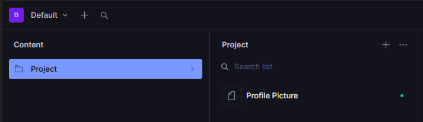

# CMS-onderzoek: Next.js Portfolio

Voor deze opdracht heb ik onderzocht welk CMS het best past bij mijn portfolio in Next.js.
Daarna heb ik een kleine werkende PoC gebouwd met Sanity + Cloudinary.

## Fase 1: Vooronderzoek

Ik heb 3 CMS-systemen vergeleken: Sanity, Contentful en Strapi.

| Systeem    | Wat is het?                                    | Voor- en nadelen                                                              | Gratis tier?     | Next.js-integratie                              | Geschikt voor portfolio?     |
| :--------- | :--------------------------------------------- | :---------------------------------------------------------------------------- | :--------------- | :---------------------------------------------- | :--------------------------- |
| Sanity     | Headless CMS (SaaS) met eigen Studio           | + Flexibel, schema in code, sterke docs. - In het begin wat leercurve (GROQ). | Ja               | Heel goed (next-sanity, App Router voorbeelden) | Ja, zeker                    |
| Contentful | Headless CMS (SaaS)                            | + Gebruiksvriendelijk en stabiel. - Gratis plan sneller beperkt.              | Ja               | Heel goed (officiële SDK + docs)                | Ja                           |
| Strapi     | Open-source headless CMS (meestal self-hosted) | + Veel controle. - Meer setup/onderhoud (hosting, updates, db).               | Ja (self-hosted) | Goed (REST/GraphQL)                             | Ja, maar zwaarder qua beheer |

## Mijn keuze

Ik heb gekozen voor Sanity.

Waarom ik die gekozen heb:

- Werkt super goed samen met Next.js.
- Ik kan mijn schema's in TypeScript schrijven i.p.v. alles in een dashboard te klikken.
- De gratis tier is ruim genoeg voor een portfolio.
- Sanity Studio zit gewoon in hetzelfde project, wat handig werkt.

## Fase 2: Proof of Concept

Wat werkt er in mijn PoC:

- Op de homepagina haal ik projecten op uit Sanity.
- Als ik content verander in Sanity, verandert de site mee zonder code aan te passen.
- Alles draait lokaal.

Contenttype dat ik nu gebruik:

- project (title, description, cloudinaryUrl)

## Fase 2b: SSR + caching + Cloudinary

### Server-side rendering / data ophalen

De data wordt opgehaald in een Server Component (geen useEffect).

Mijn keuze:

- Voor de projectenlijst gebruik ik use cache + cacheLife('hours').

Waarom:

- Projecten veranderen niet elk uur, dus cachen is logisch.
- Dat geeft minder onnodige requests en een stabiele performance.
- Als ik content zou hebben die constant verandert, zou ik eerder dynamic fetch gebruiken.

In dit project:

- cacheComponents staat aan.
- getProjects gebruikt use cache + cacheLife('hours').

### Afbeeldingen via Cloudinary

Wat ik gedaan heb:

- Afbeeldingen gehost op Cloudinary.
- Cloudinary URL opgeslagen in Sanity als veld cloudinaryUrl.
- In Next.js render ik die met de Image-component.
- remotePatterns voor res.cloudinary.com staat in de config.

Voorbeeld van een Cloudinary transformatie-URL:

https://res.cloudinary.com/<cloud-name>/image/upload/f_auto,q_auto,c_fill,w_1200,h_630/<public-id>.jpg

## Project lokaal opstarten

### Vereisten

- Node.js 20+
- npm
- Git

### 1. Clone de repo

```bash
git clone https://github.com/VerslypeBram/frontend_development_eindopdracht_portfolio.git
cd frontend_development_eindopdracht_portfolio
```

### 2. Installeer dependencies

```bash
npm install
```

### 3. Omgevingsvariabelen instellen

Maak een bestand aan in de root genaamd `.env.local` en voeg de volgende variabelen toe. Je kunt de waarden vinden in je Sanity dashboard en Cloudinary console.

```env
# Sanity
NEXT_PUBLIC_SANITY_PROJECT_ID=jouw_project_id
NEXT_PUBLIC_SANITY_DATASET=production

# Cloudinary
NEXT_PUBLIC_CLOUDINARY_CLOUD_NAME=jouw_cloud_name
```

### 4. Start de app

```bash
npm run dev
```

- Portfolio: http://localhost:3000
- Sanity Studio: http://localhost:3000/studio

## Screenshots (nog in te vullen)

### 1. Sanity Studio dashboard



### 2. Een ingevuld project in Sanity


### 3. Resultaat op de website


