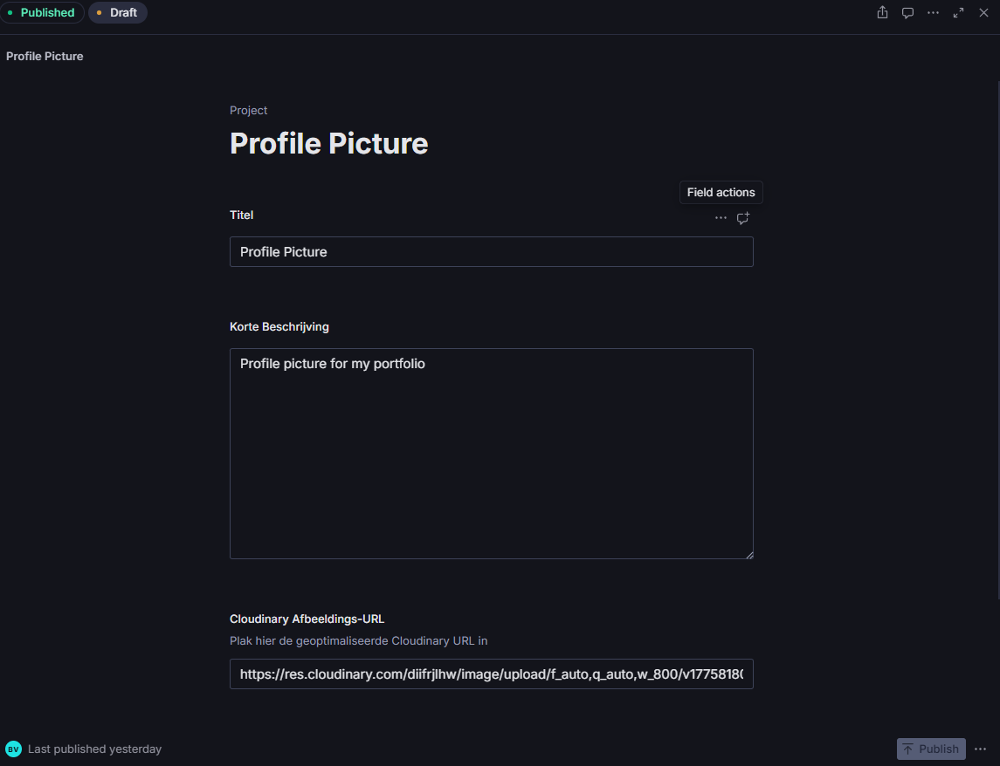
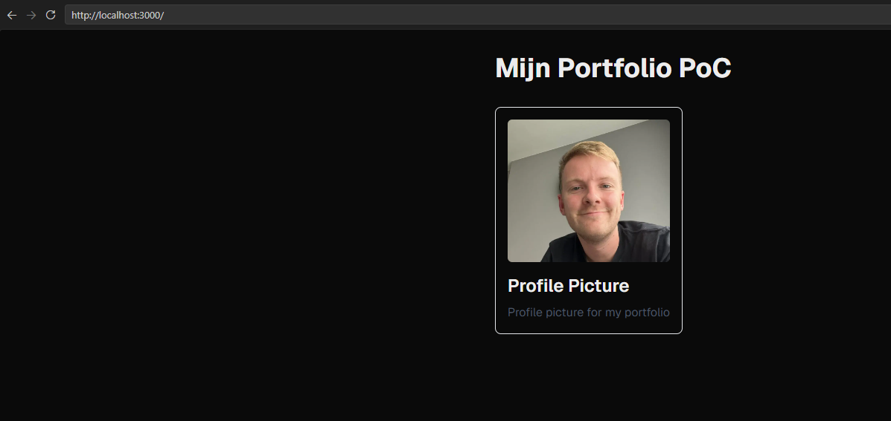
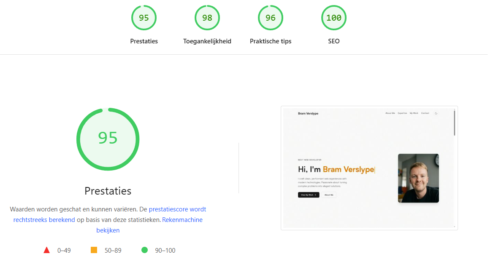

# CMS-onderzoek: Sanity voor mijn Next.js-portfolio

Onderzoek en proof of concept uit het vak Front-End Development (MCT, Howest).

## Fase 1: Vooronderzoek

Ik heb 3 CMS-systemen vergeleken: Sanity, Contentful en Strapi.

| Systeem    | Wat is het?                                    | Voor- en nadelen                                                              | Gratis tier?     | Next.js-integratie                              | Geschikt voor portfolio?     |
| :--------- | :--------------------------------------------- | :---------------------------------------------------------------------------- | :--------------- | :---------------------------------------------- | :--------------------------- |
| Sanity     | Headless CMS (SaaS) met eigen Studio           | + Flexibel, schema in code, sterke docs. - In het begin wat leercurve (GROQ). | Ja               | Heel goed (next-sanity, App Router voorbeelden) | Ja, zeker                    |
| Contentful | Headless CMS (SaaS)                            | + Gebruiksvriendelijk en stabiel. - Gratis plan sneller beperkt.              | Ja               | Heel goed (officiële SDK + docs)                | Ja                           |
| Strapi     | Open-source headless CMS (meestal self-hosted) | + Veel controle. - Meer setup/onderhoud (hosting, updates, db).               | Ja (self-hosted) | Goed (REST/GraphQL)                             | Ja, maar zwaarder qua beheer |

## Mijn keuze

Ik heb gekozen voor Sanity.

Waarom ik die gekozen heb:

- Werkt super goed samen met Next.js.
- Ik kan mijn schema's in TypeScript schrijven i.p.v. alles in een dashboard te klikken.
- De gratis tier is ruim genoeg voor een portfolio.
- Sanity Studio zit gewoon in hetzelfde project, wat handig werkt.

## Fase 2: Proof of Concept

Wat werkt er in mijn PoC:

- Op de homepagina haal ik projecten op uit Sanity.
- Als ik content verander in Sanity, verandert de site mee zonder code aan te passen.
- Alles draait lokaal.

Contenttype dat ik nu gebruik:

- `project` (title, description, cloudinaryUrl, tags)
- `hero` (name, role, bio, …)
- `aboutMe` (tekst, afbeelding, …)
- `skills` (naam, niveau, categorie, …)

## Fase 2b: SSR + caching + Cloudinary

### Server-side rendering / data ophalen

De data wordt opgehaald in een Server Component (geen useEffect).

> **Update:** in de eerste PoC gebruikte ik `'use cache'` + `cacheLife('hours')`.
> Dat is vervangen door `sanityFetch` (Sanity Live Content API) met cache-tags,
> die via een Sanity-webhook op `/api/revalidate` ververst worden. Zo verschijnt
> nieuwe content meteen, zonder elk uur onnodig opnieuw op te halen.

### Afbeeldingen via Cloudinary

Wat ik gedaan heb:

- Afbeeldingen gehost op Cloudinary.
- Cloudinary URL opgeslagen in Sanity als veld cloudinaryUrl.
- In Next.js render ik die met de Image-component.
- remotePatterns voor res.cloudinary.com staat in de config.

Een voorbeeld van een Cloudinary transformatie-URL:

`https://res.cloudinary.com/<cloud-name>/image/upload/f_auto,q_auto,c_fill,w_1200,h_630/<public-id>.jpg`

## Screenshots

### 1. Sanity Studio dashboard

### 2. Een ingevuld project in Sanity

### 3. Resultaat op de website

## Core Web Vitals (mei 2026)

### Lighthouse Rapport

Hieronder staan de resultaten van de Lighthouse scan op de live URL.

| Category           | Score |
| :----------------- | :---- |
| **Performance**    | 95    |
| **Accessibility**  | 98    |
| **Best Practices** | 96    |
| **SEO**            | 100   |

[Bekijk het volledige rapport op PageSpeed Insights](https://pagespeed.web.dev/analysis/https-www-bramverslype-be/khmk38c0lw?form_factor=desktop&category=performance&category=accessibility&category=best-practices&category=seo&hl=nl&utm_source=lh-chrome-ext)

